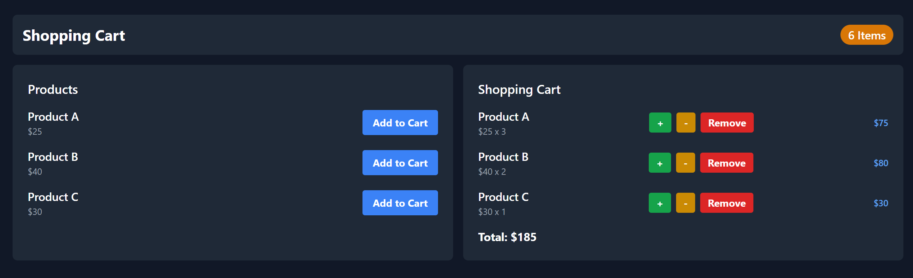

# Shopping Cart App

This is a simple shopping cart project built with React, TypeScript, and Tailwind CSS. The goal of this project is to help you understand the differences between state and props in React while creating a functional shopping cart application.



## Learning Objectives

- Understating State
- Learning the useState Hook
- Learning how to persist data between renders
- Visualizing how React renders/re-renders the App UI
- What are props
- How components communicate using props
- How to pass props from one component to another

## Features

- Add products to the cart
- Increase or decrease item quantity
- Remove items from the cart
- View total price of items in the cart
- View total number of items in the cart

## Taking a Look at the Completed Project

To set up the project after forking or downloading it from GitHub, follow these steps:

1. Open with your favorite code editor

2. Install the required dependencies by running the following command:

```
npm install
```

3. Start the development server by running the following command:

```
npm run dev
```

Happy Coding and Learning 😊
